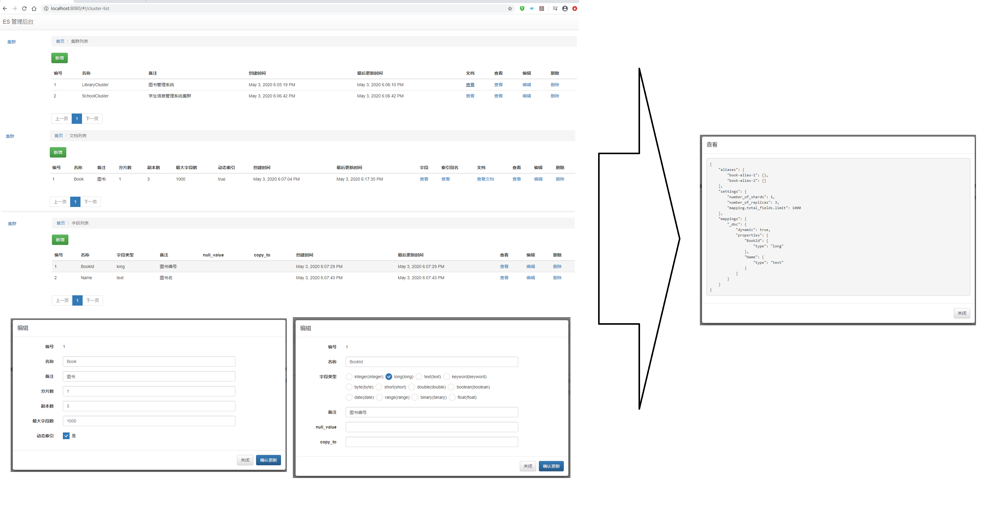
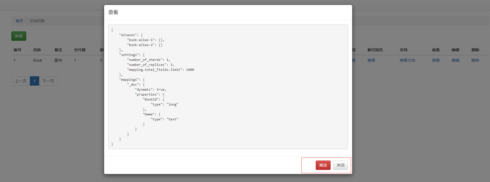
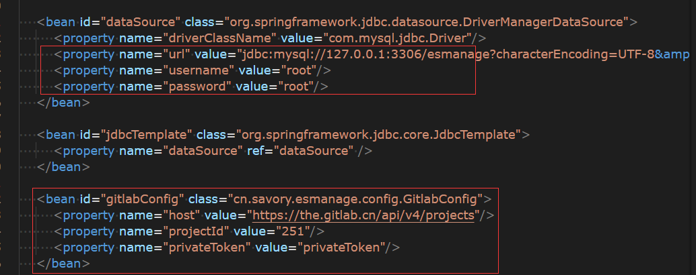

# elasticsearch-mappings-manage
elasticsearch mappings managem

## 说明

本管理后台用于管理ES集群、文档、字段，生成mappings；支持将生成的mappings推送到gitlab进行版本管理。

## 技术栈
java, spring-mvc, angularjs, bootstrap, ui.bootstrap, JdbcTemplate

## 后台截图

## 运行前配置

## 技术交流群
QQ 494069739

